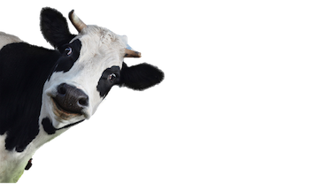

# World Dairy Expo

An identification game/homage to Wisconsin that integrates the Matter.js physics library with React and Redux.

World Dairy Expo is deployed via GitHub Pages [here](http://cjacks.net/world-dairy-expo/).
Demo also featured on Flatiron School's [Twitter](https://twitter.com/FlatironSchool/status/1002649636253913088) & [Instagram](https://www.instagram.com/p/BjfukwfBSHJ/?taken-by=flatironschool)

## Built With:

+ JavaScript
+ React
+ Redux
+ [Matter.js](https://github.com/liabru/matter-js)

## Contributing

1. Fork this repo
2. Create your feature branch (`git checkout -b feature/someFeature`)
3. Commit your changes (`git commit -am 'Added someFeature'`)
4. Push to the branch (`git push origin feature/someFeature`)
5. Create a new Pull Request
